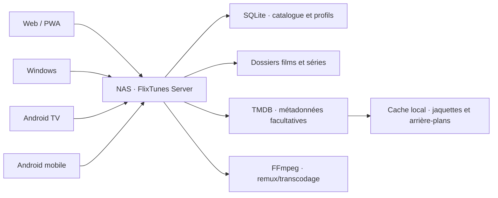

# Architecture FlixTunes

## Principes

1. **Lecture directe d'abord** : un fichier compatible avec le client est envoyé tel quel avec les requêtes HTTP `Range` (`206 Partial Content`). C'est le chemin le plus rapide et le moins coûteux pour un réseau local.
2. **Remux ensuite** : quand seuls le conteneur ou les pistes posent problème, FFmpeg remuxe sans réencoder la vidéo.
3. **Transcodage en dernier recours** : HLS adaptatif et accélération matérielle du NAS seront utilisés uniquement quand le codec, le débit ou les sous-titres l'imposent.
4. **Données locales** : SQLite en mode WAL stocke profils, catalogue et progression. Les médias restent dans les dossiers choisis par l'administrateur.
5. **Clients sans état** : tous les clients partagent l'API. La reprise fonctionne donc d'un écran à l'autre.
6. **Analyse non bloquante** : le serveur répond immédiatement, puis traite les bibliothèques l'une après l'autre pour ne pas saturer le NAS.
7. **Aucune mutation des médias** : le catalogue est organisé logiquement ; les fichiers sources ne sont ni déplacés ni renommés.

## Composants

## Sécurité locale

- Le MVP utilise des profils locaux sans mot de passe, adaptés à un LAN de confiance.
- Avant toute exposition à Internet : TLS via reverse proxy, comptes protégés, limitation de débit et jetons de session révocables.
- Les chemins disque ne sont jamais exposés dans les réponses de l'API.

## Métadonnées

Le scanner connaît le type et la langue de chaque bibliothèque. Il extrait d'abord titre, année, saison et épisode depuis les chemins, puis FFprobe analyse les tags intégrés, la durée et les langues des pistes. TMDB enrichit enfin le résultat avec les titres, synopsis et images localisés, ainsi que les identifiants IMDb disponibles.

Le catalogue normalisé sépare films, séries, saisons et épisodes des fichiers physiques. Chaque niveau peut recevoir ses propres métadonnées et sa propre jaquette. Les images locales (`poster`, `folder`, `cover`, `backdrop`, `fanart`) sont prioritaires ; les images TMDB localisées sont mises en cache dans le stockage de données du serveur. L'API ne renvoie aux clients que des URL FlixTunes opaques.

La correspondance automatique utilise la similarité du titre et l'année. Une correction explicite dans l'interface enregistre l'identifiant TMDB, marque la correspondance comme manuelle et la verrouille pour les analyses suivantes.

## Cycle d'analyse

- Une installation neuve reste sans bibliothèque jusqu'à la validation de l'assistant.
- Les bibliothèques confirmées sont persistées uniquement sur le serveur.
- Le démarrage place un scan incrémental de chaque bibliothèque dans une file à concurrence unique.
- Un fichier inchangé est seulement marqué disponible ; FFprobe et TMDB ne sont pas rappelés.
- Un rafraîchissement de métadonnées force l'enrichissement des éléments existants.
- Un fichier disparu est marqué indisponible dans le catalogue, sans opération sur le stockage.
